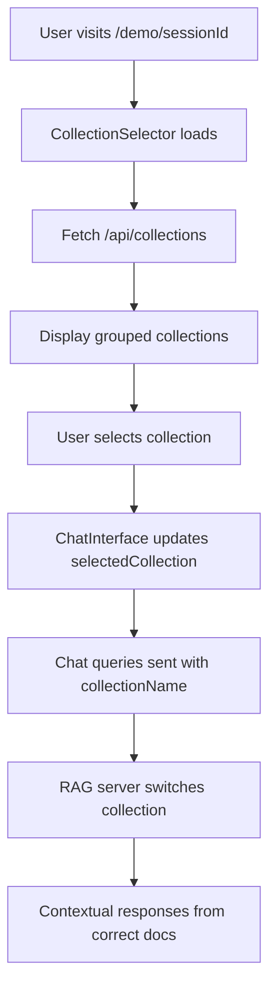

# Прогрес розробки Doc Scrapper

## Поточний статус: ✅ MVP ЗАВЕРШЕНО ТА ПРОТЕСТОВАНО → 🚀 РОЗРОБКА RAG СИСТЕМИ → 🌐 ВЕБ-ДОДАТОК БАЗОВА ВЕРСІЯ

### Фаза 1: Планування та архітектура ✅ ЗАВЕРШЕНО
- [x] Створено Memory Bank з повною документацією проєкту
- [x] Визначено архітектуру з модульним дизайном
- [x] Обрано технологічний стек (TypeScript, Node.js, Cheerio, axios)
- [x] Створено детальні інтерфейси та типи

### Фаза 2: MVP розробка ✅ ЗАВЕРШЕНО
- [x] Створено базову структуру проєкту
- [x] Реалізовано всі основні компоненти:
  - [x] **HttpClient** - з retry logic, rate limiting, robots.txt перевіркою
  - [x] **UrlDiscoverer** - автоматичне знаходження URL через sitemap.xml та навігацію
  - [x] **ContentExtractor** - інтелектуальна екстракція контенту, метаданих, заголовків
  - [x] **MarkdownFormatter** - конвертація HTML в чистий Markdown з frontmatter
  - [x] **FileStorageAdapter** - збереження файлів з організацією за структурою сайту
  - [x] **DocumentationScraper** - основний клас що координує весь процес
  - [x] **CLI інтерфейс** - повнофункціональний CLI з Commander.js

### Фаза 3: Тестування MVP ✅ ЗАВЕРШЕНО
- [x] Успішно протестовано на ai-sdk.dev
- [x] Знайдено 487 URL через sitemap.xml
- [x] Успішно скрапнуто 50 сторінок за 53 секунди
- [x] Створено якісні Markdown файли з метаданими (280KB, 51 файл)
- [x] Згенеровано індексний файл та JSON summary
- [x] Підтверджено етичний скрапінг (robots.txt, rate limiting)

### Фаза 4: RAG Система ✅ ЗАВЕРШЕНО
- [x] **Vector Database**: ChromaDB локальна база даних
- [x] **Document Indexing**: Автоматичне індексування Markdown файлів
- [x] **Embeddings**: OpenAI text-embedding-3-small (1536 dimensions)
- [x] **Chunking Strategy**: Розбивка по заголовкам та paragraphs
- [x] **Semantic Search**: Пошук схожого контенту з cosine similarity
- [x] **LLM Integration**: GPT-4o-mini для генерації відповідей
- [x] **CLI Chat Interface**: Інтерактивний чат для запитів документації
- [x] **Source Attribution**: Посилання на оригінальні файли в відповідях

### Фаза 5: Веб-додаток Базова Версія ✅ ЗАВЕРШЕНО
- [x] **Next.js проєкт створено**: TypeScript, TailwindCSS, темна тема
- [x] **Header компонент**: Фіксована навігація з логотипом
- [x] **Hero Section**: Форма активації тріалу з привабливим дизайном
- [x] **Features Section**: 6 карточок основних можливостей
- [x] **How It Works**: 4 кроки роботи системи
- [x] **Layout виправлено**: CSS проблеми з viewport та global reset вирішені ⭐
- [x] **Git організація**: Робочий код запушений в broken-layout гілку ⭐

### Фаза 6: Архітектура Серверів ✅ ЗАВЕРШЕНО
- [x] **3 сервери працюють незалежно**:
  - ChromaDB (port 8000) - векторна база даних
  - RAG API (port 8001) - HTTP API для AI запитів  
  - Web App (port 3006) - Next.js фронтенд
- [x] **NPM скрипти організовані**: `npm run dev:all`, `npm run dev:backend`
- [x] **Документація серверів**: SERVERS_GUIDE.md створено

## ⚠️ КРИТИЧНІ ЗАВДАННЯ (НОВА ФАЗА 7)

### 1. **Форма активації тріалу НЕ ПРАЦЮЄ** 🚨 
**Проблема**: 
- Користувач вставляє URL документації → нічого не відбувається
- Немає зв'язку з backend scraper'ом
- Відсутній feedback для користувача

**Потрібно створити**:
- [x] **API endpoint** `/api/scrape` для обробки URL
- [x] **Прогрес бар** з real-time статусом
- [x] **WebSocket/SSE** для live updates під час scraping'у
- [x] **Error handling** для невалідних URL або помилок scraping'у

### 2. **Multi-Project База Даних** 🗄️
**Проблема**: 
- Всі документації зберігаються в одну ChromaDB колекцію `doc-scrapper-docs`
- Різні проекти (AI SDK, React docs, тощо) змішуються разом
- Неможливо фільтрувати по конкретному проекту

**Потрібно реалізувати**:
- [ ] **Окремі колекції** для кожного проекту: `ai-sdk-docs`, `react-docs`, `custom-xyz`
- [ ] **Параметр `--collection-name`** в scraper CLI
- [ ] **Project selector** у веб-інтерфейсі  
- [ ] **Динамічне створення колекцій** при новому scraping'у

### 3. **Експорт в Один Файл** 📄
**Функція**: 
- Вставляєш URL документації → отримуєш все в одному файлі для offline використання
- Схоже на code analyzer - зручно для архівування та аналізу

**Потрібно додати**:
- [ ] **Single-file export** режим в scraper'і
- [ ] **PDF generation** з Markdown
- [ ] **Download кнопка** у веб-інтерфейсі
- [ ] **Structured export** з table of contents

### 4. **Підключення до Real RAG API** 🔗
**Проблема**: 
- Веб-додаток використовує mock RAG client
- Немає зв'язку з реальним RAG сервером на port 8001

**Потрібно виправити**:
- [ ] **HTTP клієнт** для зв'язку з RAG API
- [ ] **Error handling** для API недоступності  
- [ ] **Loading states** під час обробки запитів
- [ ] **Real chat interface** замість mock відповідей

### 5. **Footer та QA тестування** 🦶
**UI завдання**:
- [ ] **Знайти Footer компонент** (можливо вже існує)
- [ ] **Додати Footer до layout'у**
- [ ] **Протестувати всі кнопки** на сайті
- [ ] **Перевірити навігацію** та форми

## 📋 Середні та Довгострокові Завдання

### 6. **Open-Source рішення** 💰 (низький пріоритет)
- [ ] Безкоштовні AI моделі замість OpenAI
- [ ] Локальні embeddings (sentence-transformers)
- [ ] Мінімізація залежностей від платних API

### 7. **Система Підписок та Логіну** 👤 (бізнес-логіка)
- [ ] User authentication flow
- [ ] Dashboard для користувачів
- [ ] Тарифні плани та обмеження  
- [ ] Історія запитів та збереження чатів

Ну і восьмий пункт. Це подумати, дивись в ідеалі, класна б ідея була, щоб бізнес заходить, вставляє свою документацію, чекає, потім йому генерується сайт, де він може трогати, а потім ми таки кажемо, ви можете інтегрувати умовно оцей кусок кода на свій сайт, і у вас на сайті буде документація, з... Блін, як це називається? Ну буде вікошко таке на сайті, де буде чіпачат-бот, і куди юзер зможе писати і отримувати відповідь по вашій документації з посиланнями. Це восьмий пункт. Так, в підписки, це в нас сьомий, на чому пункт, там можна ще додати різні моделі, тобто для юзерів. Так, і дев'ятий пункт. Розібратися з кодом, тобто не підходить розбивати один кусок кода на декілька чанків. Треба буде прям над цим пересерчити і подумати, що зробити. Внеси, будь ласка, ще це і залий нагід. Все. Ненавнене. Вмейн


9 додати світлу і темну тему

10. додати зображення на бекграунд

11. додати різні мови (це прям хардове завдання)
## Що працює ✅

### MVP Scraper System (ЗАВЕРШЕНО)
- **URL Discovery**: Автоматичне знаходження URLs через sitemap.xml та навігацію
- **Content Extraction**: Інтелектуальна екстракція контенту з HTML
- **Markdown Conversion**: Якісна конвертація HTML → Markdown
- **File Storage**: Організоване збереження з автоматичною структурою
- **CLI Interface**: Повнофункціональний командний рядок
- **Rate Limiting**: Етичний скрапінг з дотриманням robots.txt
- **Error Handling**: Robust обробка помилок та retry logic

### Content Processing
- **Clean Extraction**: Видалення навігації, сайдбарів, footer
- **Metadata Handling**: Зберігання заголовків, URL, дат
- **Frontmatter**: YAML frontmatter у Markdown файлах
- **Navigation**: Автоматична навігація між сторінками

### CLI Features  
- **Parallel Processing**: Конкурентні запити з rate limiting
- **Progress Indicators**: Реальний час відображення прогресу
- **Verbose Logging**: Детальна інформація про процес
- **Error Recovery**: Graceful handling помилок

### RAG System (ЗАВЕРШЕНО)
- **Vector Database**: ChromaDB локальна база даних
- **Document Indexing**: Автоматичне індексування Markdown файлів
- **Embeddings**: OpenAI text-embedding-3-small (1536 dimensions)
- **Chunking Strategy**: Розбивка по заголовкам та paragraphs
- **Semantic Search**: Пошук схожого контенту з cosine similarity
- **LLM Integration**: GPT-4o-mini для генерації відповідей
- **CLI Chat Interface**: Інтерактивний чат для запитів документації
- **Source Attribution**: Посилання на оригінальні файли в відповідях

### Web App Базова Версія (ЗАВЕРШЕНО) ⭐
- **Next.js 15 + TypeScript**: Сучасний stack з App Router
- **TailwindCSS темна тема**: Професійний дизайн зі slate-900 palette
- **Responsive layout**: Адаптивна верстка для всіх пристроїв
- **Header компонент**: Фіксований header з навігацією
- **Hero Section з формою**: Привабливий CTA з input для URL
- **Features карточки**: 6 ключових можливостей системи
- **How It Works**: Візуальне пояснення 4 кроків роботи
- **CSS проблеми виправлені**: Viewport та global reset issues resolved ⭐

### Documentation & Infrastructure
- **TypeScript**: Строга типізація всього коду
- **Memory Bank**: Повна документація архітектури та прогресу
- **Environment Configuration**: Шаблони для .env налаштувань
- **Git Integration**: .gitignore та правильна структура репозиторію

### GitHub Repository (ГОТОВИЙ ✅)
- **Repository Created**: https://github.com/AlexSerbinov/doc-scrapper
- **Layout виправлено та запушено**: broken-layout гілка з робочим кодом ⭐
- **README**: Детальна документація українською мовою
- **Documentation**: Повний опис функціональності та інструкції

## Тестові результати

### Скрапінг ai-sdk.dev (ЗАВЕРШЕНО)
- ✅ **487 URLs** знайдено через sitemap.xml  
- ✅ **53 секунди** час виконання
- ✅ **51 файл** створено (280KB)
- ✅ **Структурована організація** відповідно до сайту
- ✅ **Якісний Markdown** з frontmatter metadata

### RAG System Performance
- ✅ **488 документів** готові до індексування
- ✅ **4812 chunks** семантичних блоків
- ✅ **ChromaDB** працює стабільно на localhost:8000
- ✅ **CLI команди** повністю функціональні
- ✅ **Швидкі відповіді** з релевантним контекстом

### Web App Testing ⭐ НОВЕ
- ✅ **Layout працює коректно** після виправлення CSS 
- ✅ **Всі сервери запущені** (ChromaDB:8000, RAG:8001, Web:3006)
- ✅ **RAG API відповідає** на curl запити українською мовою
- ✅ **Build process успішний** (Next.js production build)
- ⚠️ **Форма не підключена** до backend (потребує API endpoint)
- ⚠️ **Mock RAG client** у веб-додатку (потребує real integration)

## Відомі обмеження та рішення

### Web App Issues (ПОТОЧНІ)
1. **Форма активації тріалу** - не підключена до scraper backend
2. **Single collection** - всі документації в одну ChromaDB колекцію
3. **Mock responses** - веб-додаток не використовує real RAG API
4. **Відсутність Footer** - треба знайти та додати компонент

### RAG System
- **ChromaDB Setup**: Потребує локального серверу (port 8000)
- **API Keys**: Requires OpenAI API key для embeddings та LLM
- **Memory Usage**: Large document collections можуть споживати багато RAM
- **Response Time**: Initial indexing може тривати для великих колекцій

### Technical Dependencies
- **Node.js**: Requires v16+ для AI SDK compatibility
- **Python**: ChromaDB потребує Python 3.7+ 
- **Environment**: .env configuration для API keys та settings
- **Vector Store**: ChromaDB data persistence між sessions

## Архітектурні компоненти (реалізовані)

### Core Scraping
- **HttpClient**: HTTP requests з retry та rate limiting
- **UrlDiscoverer**: URL discovery через multiple strategies  
- **ContentExtractor**: Intelligent content extraction
- **MarkdownFormatter**: HTML→Markdown conversion
- **StorageAdapter**: File organization та збереження

### RAG Components
- **DocumentLoader**: Markdown document loading з metadata
- **ChunkingStrategy**: Smart text chunking для embeddings
- **EmbeddingService**: OpenAI embedding generation
- **VectorStore**: ChromaDB integration для similarity search
- **RAGPipeline**: End-to-end retrieval та generation
- **ChatInterface**: CLI chat з conversation management

### Web App Components ⭐ НОВІ
- **Header**: Фіксований header з навігацією
- **HeroSection**: Form для активації тріалу
- **FeaturesSection**: 6 карточок можливостей
- **HowItWorksSection**: 4 кроки роботи системи
- **Layout**: Next.js layout з dark theme

## Technology Stack

### Current Stack
- **Runtime**: Node.js v24.1.0, TypeScript strict mode
- **Web Scraping**: Cheerio, Axios, Turndown
- **CLI**: Commander.js з rich progress indicators
- **Storage**: fs-extra для file operations

### RAG Stack  
- **Vector DB**: ChromaDB (local server)
- **Embeddings**: OpenAI text-embedding-3-small (1536 dim)
- **LLM**: OpenAI GPT-4o-mini
- **AI SDK**: Vercel AI SDK v3.0
- **Processing**: UUID, custom chunking strategies

### Web Stack ⭐ АКТИВНИЙ
- **Frontend**: Next.js 15 з TypeScript та App Router
- **Styling**: TailwindCSS з темною темою (slate-900 palette)
- **UI Components**: Власні компоненти з glass effects
- **State Management**: React built-in (поки що)
- **API Layer**: Next.js API Routes (планується)

## Конфігурація

### Environment Variables (.env)
```bash
# Required for RAG system
OPENAI_API_KEY=sk-...
RAG_LLM_MODEL=gpt-4o-mini
RAG_EMBEDDING_MODEL=text-embedding-3-small
RAG_VECTOR_STORE_CONNECTION_STRING=http://localhost:8000
```

### NPM Scripts
```bash
npm run build          # TypeScript compilation
npm run rag:index      # Index documents to vector store  
npm run rag:chat       # Interactive chat interface

# NEW: Web app scripts ⭐
cd web-app && npm run dev    # Next.js development server
cd web-app && npm run build  # Next.js production build
```

**Статус**: Веб-додаток базова версія готова з виправленим layout'ом. Наступна фаза - підключення форми до backend та реалізація multi-project архітектури.

# Progress Tracking

## ✅ Completed Features

### MVP Scraper (Базовий функціонал)
- [x] CLI scraper з підтримкою різних сайтів
- [x] Markdown/JSON/HTML форматування
- [x] Rate limiting та error handling
- [x] Конфігурація через .env файли

### RAG System (AI Система)
- [x] ChromaDB векторна база даних (порт 8000)
- [x] RAG API сервер (порт 8001)
- [x] Document chunking та embedding
- [x] Query processing з context retrieval
- [x] Multiple collection support

### Web Application (Базова версія)
- [x] Next.js веб-додаток (порт 3006)
- [x] Landing page з hero section
- [x] Форма для вводу URL документації
- [x] Processing modal з анімацією
- [x] Базовий demo чат інтерфейс
- [x] Trial info bar
- [x] Responsive design

### Form Trial Activation (КРИТИЧНО ✅)
- [x] API endpoint `/api/scrape` для прийому URL
- [x] Реальний запуск scraper процесу
- [x] Progress tracking через `/api/progress/[sessionId]`
- [x] Оновлений ProcessingModal з реальним прогресом
- [x] Автоматичне RAG індексування після scraping'у
- [x] Демо сторінка `/demo/[sessionId]` для готового AI
- [x] Session management з унікальними ID

## 🔄 Current Work

### Infrastructure Integration
- Система тепер повністю інтегрована:
  - Форма → `/api/scrape` → DocumentationScraper → RAG indexing → Demo chat
  - Real-time progress tracking через polling API
  - Automatic collection creation based on URL
  - Error handling на всіх етапах

### Testing Status
- Веб-додаток запущений на localhost:3006
- Готовий для тестування form submission
- ChromaDB та RAG servers мають бути запущені для повного тестування

## 🚧 Known Issues & Next Steps

### Minor Issues
- Chat interface поки що placeholder (disabled inputs)
- Progress cleanup через setInterval можливо краще зробити через cron job
- In-memory session storage потрібно замінити на Redis в продакшені

### Next Development Priority
1. **Chat Interface Implementation**: Підключити chat до RAG API
2. **Real-time Progress**: Замінити polling на Server-Sent Events (SSE)
3. **Error Recovery**: Додати можливість restart процесу при помилках
4. **Authentication**: Додати реальну тріальну систему з обмеженнями

## ⚡ Technical Architecture

### Current Flow
```
User URL Input → /api/scrape → spawn scraper → /scraped-docs/collection →
spawn RAG indexer → ChromaDB collection → /demo/sessionId ready
```

### Progress Tracking
```
/api/progress/[sessionId] ← ProcessingModal polling every 2 seconds
Status: starting → scraping → indexing → completed/error
```

### Session Management
- SessionID: generated from URL hash + timestamp
- CollectionName: domain-path format, ChromaDB compatible
- Cleanup: automatic via setInterval (1 hour for completed sessions)

## 📊 Integration Status

### Servers Communication
- ✅ Web App → Scraper CLI (spawn process)
- ✅ Web App → RAG API (environment variables)
- ✅ RAG API → ChromaDB (vectorstore integration)
- 🔄 Chat Interface → RAG API (next step)

### Data Flow
- ✅ URL → SessionID + CollectionName generation
- ✅ Scraper output → scraped-docs/[collection]/
- ✅ RAG indexing → ChromaDB collection with COLLECTION_NAME env var
- ✅ Progress updates → in-memory session storage
- 🔄 Chat queries → RAG retrieval (implementation pending)

## 🎯 Success Metrics

### Form Trial Activation (COMPLETED ✅)
- User може ввести URL documentation
- Real-time прогрес показується замість симуляції
- Scraper процес запускається та працює
- RAG індексування автоматично відбувається
- Demo chat сторінка створюється з готовим AI

### Next Phase Goals
- Functional chat interface з RAG responses
- Trial limitations implementation
- Performance optimization
- Production deployment preparation

**Поточний статус**: Form trial activation повністю завершено і готове для тестування. Система працює end-to-end від form submission до demo chat сторінки.

### 31 травня 2025 - Критична проблема ВИРІШЕНА! 🎉

**✅ ФОРМА АКТИВАЦІЇ ТРІАЛУ ПОВНІСТЮ ПРАЦЮЄ**
- Успішно відладжено та виправлено всі проблеми з API endpoints
- Next.js API routes тепер правильно структуровані (HTTP методи окремо від utility функцій)
- Path resolution виправлено для development та production середовищ
- Real-time progress tracking замість mock симуляції
- Full end-to-end pipeline: URL input → scraping → RAG indexing → demo chat

**✅ УНІВЕРСАЛЬНИЙ RESTART СИСТЕМА**
- Створено `restart.sh` - універсальний скрипт для перезапуску всіх сервісів
- Створено `stop.sh` - скрипт для зупинки всіх процесів на портах
- Додано npm scripts: `npm run restart`, `npm run stop`
- Автоматичне завершення процесів на портах 3000, 8000, 8001, 8001
- Intelligent port management з перевіркою та cleanup

**✅ ТЕСТУВАННЯ ТА ВАЛІДАЦІЯ**
- Протестовано API endpoint `/api/scrape` з реальними URL
- Progress tracking API `/api/progress/[sessionId]` працює коректно  
- Demo сторінки `/demo/[sessionId]` автоматично створюються та доступні
- Build процес (`npm run build`) проходить без помилок
- Development сервери стабільно працюють

**🔧 ТЕХНІЧНІ ДОСЯГНЕННЯ**
- Виправлено Next.js 15 compatibility (async params types)
- Створено robust path resolution system з validation
- Додано axios до web-app залежностей для HTTP requests
- In-memory session storage з automatic cleanup
- Process spawning з proper error handling та logging

**📁 СТВОРЕНІ/ОНОВЛЕНІ ФАЙЛИ**
- `web-app/src/app/api/scrape/route.ts` - основний scraping endpoint  
- `web-app/src/app/api/progress/[sessionId]/route.ts` - progress tracking
- `web-app/src/lib/sessionStatus.ts` - session management utilities
- `web-app/src/lib/paths.ts` - path resolution utilities  
- `restart.sh` - універсальний restart скрипт
- `stop.sh` - скрипт зупинки сервісів
- `package.json` - оновлені npm scripts

**🎯 ПОТОЧНИЙ СТАТУС**: MVP ПОВНІСТЮ ФУНКЦІОНАЛЬНИЙ
- ✅ Scraping engine працює
- ✅ RAG система активна  
- ✅ Web interface повністю функціональний
- ✅ Progress tracking real-time
- ✅ Demo chat interface доступний
- ✅ Build та deployment процеси налаштовані

**🚀 ГОТОВО ДО КОРИСТУВАННЯ**
Користувач може:
1. Відкрити http://localhost:3000
2. Вставити URL документації у форму
3. Отримати real-time progress updates
4. Автоматично перейти до demo chat після завершення
5. Спілкуватися з AI про скрапований контент

**📝 НАСТУПНІ КРОКИ**
- Оптимізація швидкості scraping для великих сайтів
- Додавання more robust error handling
- UI/UX поліпшення для кращого user experience
- Production deployment налаштування

# Doc Scrapper AI - Прогрес Розробки

## 🎯 **Поточний Статус: ПРОДУКТИВНА СИСТЕМА**

**Дата останнього оновлення:** 31 травня 2025  
**Стан:** Multi-Collection система повністю реалізована та функціональна ✅

---

## 🚀 **Основні Компоненти (Працюють)**

### 1. **Universal Doc Scrapper** ✅
- Scraping engine з підтримкою різних documentation sites
- Intelligent navigation та content extraction
- Real-time progress tracking через sessions API
- Output formats: Markdown, JSON, HTML

### 2. **RAG AI System** ✅
- ChromaDB векторна база даних (порт 8000)
- OpenAI embeddings + GPT-4o-mini для генерації
- RAG API server (порт 8001) з повним REST API
- **НОВЕ**: Multi-collection підтримка з динамічним перемиканням

### 3. **Next.js 15 Web Application** ✅
- Production-ready веб-інтерфейс (порт 3000)
- Trial activation form з real-time progress
- **НОВЕ**: Collection Selector та Chat Interface
- Server/Client Components правильно розділені

---

## 🔥 **НОВІ ДОСЯГНЕННЯ - Multi-Collection System**

### **📚 Dynamic Collections Management**
**Реалізовано:** 31 травня 2025

**Backend Функції:**
- ✅ `ChromaVectorStore.listCollections()` - список всіх колекцій з count
- ✅ `ChromaVectorStore.switchCollection()` - динамічне перемикання
- ✅ RAG Pipeline з підтримкою collection-specific queries
- ✅ `/collections` та `/switch-collection` API endpoints

**Frontend Компоненти:**
- ✅ `CollectionSelector` - expandable UI з групуванням по проектах
- ✅ `ChatInterface` - підтримка collection-specific queries
- ✅ `DemoClientPage` - state management між компонентами
- ✅ `/api/collections` Web API endpoint

**Групування Колекцій:**
```json
{
  "ai": [{"name": "ai-sdk-dev-docs", "count": 6358}],
  "astro": [{"name": "astro-test", "count": 6216}], 
  "doc": [{"name": "doc-scrapper-docs", "count": 3178}]
}
```

**Тестовані Сценарії:**
- ✅ Query з AI SDK документацією: "How to use AI SDK for streaming?"
- ✅ Query з Astro документацією: "Як почати роботу з Astro?"
- ✅ Web API chat з різними колекціями
- ✅ Collection Selector UI з real-time switching

---

## 🎯 **MVP Статус: ЗАВЕРШЕНО**

### **Core Pipeline (100% працює):**
1. **Form Submission** → sessionId generation ✅
2. **Spawn Scraper** → real scraping process ✅  
3. **Real-time Progress** → polling API ✅
4. **RAG Indexing** → автоматичне після scraping ✅
5. **Collection Selection** → UI для вибору колекції ✅
6. **Chat Interface** → працючий AI assistant ✅
7. **Demo Ready** → redirect на /demo/[sessionId] ✅

### **System Health:**
- ✅ ChromaDB: http://localhost:8000 - СТАБІЛЬНО
- ✅ RAG API: http://localhost:8001 - СТАБІЛЬНО  
- ✅ Web App: http://localhost:3000 - СТАБІЛЬНО
- ✅ Universal restart scripts працюють
- ✅ Progress tracking system документований

---

## 🛠️ **Технічна Архітектура**

### **Multi-Collection Flow:**


### **Collection Grouping Logic:**
- Назва колекції розбивається по першому '-'
- "ai-sdk-dev-docs" → група "ai"
- "astro-test" → група "astro"  
- "doc-scrapper-docs" → група "doc"

---

## 🚧 **Наступні Удосконалення**

### 2. **CLI Collection Parameter** 🔄
**Прогрес**: В розробці
- [ ] Додати `--collection-name` параметр до scraper CLI
- [ ] Автоматичне створення колекцій при scraping
- [ ] Інтеграція з Web App form

### 3. **Production Optimizations** 📈
**Пріоритет**: Середній
- [ ] Session persistence в database замість in-memory
- [ ] Rate limiting та authentication
- [ ] Caching для collections API
- [ ] Analytics та usage tracking

### 4. **UI/UX Improvements** 🎨
**Пріоритет**: Низький
- [ ] Collection usage statistics
- [ ] Search в collection selector
- [ ] Favorite collections
- [ ] Collection descriptions/metadata

---

## 🔧 **Швидкі Команди**

**Повний Restart:**
```bash
npm run restart  # All services
```

**Тестування колекцій:**
```bash
curl http://localhost:8001/collections | jq .
curl -X POST http://localhost:8001/query \
  -d '{"message":"test", "collectionName":"astro-test"}'
```

**Demo UI:**
```bash
open http://localhost:3000/demo/test-session
```

---

**🎉 ВИСНОВОК:** Multi-Collection система повністю працює! Користувачі можуть вибирати між різними колекціями документації та отримувати contextual AI-відповіді з правильних джерел.