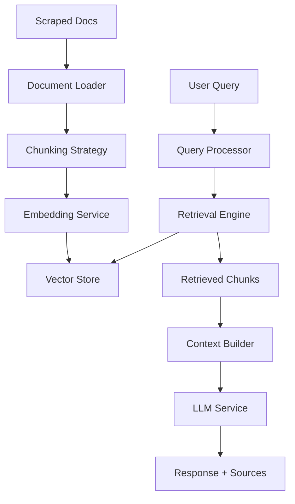

# RAG Архітектура - Doc Scrapper

## Огляд RAG системи

RAG (Retrieval-Augmented Generation) система для чат-бота на основі скрапнутої документації. Система складається з двох основних компонентів: Retrieval Engine та Generation Engine.

## Архітектурна схема

```
Користувач → Query → RAG Pipeline → Response
                ↓
    1. Query Processing
    2. Document Retrieval  
    3. Context Formation
    4. LLM Generation
    5. Response + Sources
```

## Основні компоненти

### 1. Document Processing Pipeline

```typescript
interface DocumentChunk {
  id: string;
  content: string;
  metadata: {
    sourceUrl: string;
    title: string;
    section: string;
    filePath: string;
    chunkIndex: number;
  };
  embedding: number[];
}
```

**Компоненти:**
- **MarkdownLoader** - завантаження існуючих MD файлів
- **ChunkingStrategy** - розбивка на частини (500-1000 токенів)
- **EmbeddingService** - векторизація через OpenAI/Cohere
- **VectorStore** - збереження в базі векторів

### 2. Retrieval Engine

```typescript
interface RetrievalResult {
  chunks: DocumentChunk[];
  scores: number[];
  query: string;
  retrievalMethod: 'semantic' | 'hybrid' | 'keyword';
}
```

**Компоненти:**
- **SemanticSearch** - пошук по embedding векторах
- **KeywordSearch** - traditional text search (BM25)
- **HybridSearch** - комбінація semantic + keyword
- **ResultRanker** - ранжування та фільтрація

### 3. Generation Engine

```typescript
interface ChatResponse {
  content: string;
  sources: SourceReference[];
  model: string;
  tokensUsed: number;
}

interface SourceReference {
  title: string;
  url: string;
  excerpt: string;
}
```

**Компоненти:**
- **ContextBuilder** - формування контексту з retrieved chunks
- **PromptTemplate** - шаблони для різних типів запитів
- **LLMService** - інтеграція з OpenAI/Anthropic
- **ResponseFormatter** - форматування з source citations

## Технічний стек

### Embedding моделі
- **OpenAI**: `text-embedding-3-small` (економічна)
- **OpenAI**: `text-embedding-3-large` (якісна)
- **Cohere**: `embed-english-v3.0` (альтернатива)

### Vector Databases
1. **ChromaDB** (рекомендований для прототипу)
   - Легка інсталяція та налаштування
   - Python/JS SDK
   - Локальне зберігання

2. **Pinecone** (для продукції)
   - Managed service
   - Швидший пошук
   - Масштабування

3. **FAISS** (локальна альтернатива)
   - Facebook AI Similarity Search
   - Без зовнішніх сервісів
   - Висока продуктивність

### LLM провайдери
- **OpenAI**: GPT-4, GPT-3.5-turbo
- **Anthropic**: Claude-3.5-sonnet
- **Local**: Ollama з місцевими моделями

## Архітектура файлів

```
src/
├── rag/
│   ├── core/
│   │   ├── ragPipeline.ts
│   │   ├── documentProcessor.ts
│   │   └── contextBuilder.ts
│   ├── embedding/
│   │   ├── embeddingService.ts
│   │   ├── openaiEmbedding.ts
│   │   └── cohereEmbedding.ts
│   ├── chunking/
│   │   ├── chunkingStrategy.ts
│   │   ├── markdownChunker.ts
│   │   └── recursiveChunker.ts
│   ├── vectorstore/
│   │   ├── vectorStore.ts
│   │   ├── chromaStore.ts
│   │   ├── pineconeStore.ts
│   │   └── faissStore.ts
│   ├── retrieval/
│   │   ├── retrievalEngine.ts
│   │   ├── semanticSearch.ts
│   │   ├── hybridSearch.ts
│   │   └── resultRanker.ts
│   └── generation/
│       ├── llmService.ts
│       ├── promptTemplates.ts
│       └── responseFormatter.ts
├── chat/
│   ├── chatService.ts
│   ├── sessionManager.ts
│   └── queryProcessor.ts
└── api/
    ├── ragApi.ts
    └── chatApi.ts
```

## Workflow діаграма



## Конфігурація (.env)

```bash
# Embedding провайдер
EMBEDDING_PROVIDER=openai
OPENAI_API_KEY=sk-...
COHERE_API_KEY=...

# Vector Database
VECTOR_DB=chroma
CHROMA_HOST=localhost
CHROMA_PORT=8000
PINECONE_API_KEY=...
PINECONE_INDEX=doc-scrapper

# LLM провайдер  
LLM_PROVIDER=openai
LLM_MODEL=gpt-4
ANTHROPIC_API_KEY=...

# RAG параметри
CHUNK_SIZE=800
CHUNK_OVERLAP=100
RETRIEVAL_K=5
TEMPERATURE=0.1
```

## Метрики та моніторинг

### Performance метрики
- **Retrieval Latency** - час пошуку документів
- **Generation Latency** - час генерації відповіді
- **Total Response Time** - загальний час відповіді
- **Embedding Time** - час векторизації

### Quality метрики
- **Retrieval Precision** - релевантність знайдених документів
- **Answer Relevance** - відповідність відповіді запиту
- **Source Attribution** - точність посилань на джерела
- **User Satisfaction** - оцінки користувачів

## Планування розробки

### Фаза 1: Базова RAG (Тиждень 1)
1. Завантаження та chunking існуючих MD файлів
2. Базовий embedding service (OpenAI)
3. ChromaDB інтеграція
4. Простий semantic search
5. Базова генерація відповідей

### Фаза 2: Поліпшення (Тиждень 2)
1. Hybrid search (semantic + keyword)
2. Кращі chunking стратегії
3. Метадані та фільтрація
4. Source citations
5. Query expansion

### Фаза 3: Інтерфейси (Тиждень 3)
1. CLI чат-бот
2. REST API
3. Web UI (Next.js)
4. Session management
5. Історія запитів

### Фаза 4: Оптимізація (Тиждень 4)
1. Кешування результатів
2. Parallel retrieval
3. Performance monitoring
4. A/B testing різних стратегій
5. User feedback система

## Потенційні виклики

### Технічні
- **Chunking strategy** - оптимальний розмір та overlap
- **Embedding quality** - вибір моделі та параметрів
- **Context window** - ліміти LLM на розмір контексту
- **Performance** - швидкість retrieval та generation

### Якість
- **Hallucinations** - LLM може вигадувати інформацію
- **Context relevance** - retrieved chunks можуть бути нерелевантними
- **Source accuracy** - правильність посилань на джерела
- **Query understanding** - складні або неоднозначні запити

## Рішення та мітигації

1. **Chunking**: Експериментувати з різними розмірами (500-1500 токенів)
2. **Retrieval**: Hybrid search для кращої якості
3. **Generation**: System prompts з інструкціями про використання лише наданого контексту
4. **Monitoring**: Детальне логування для аналізу та поліпшення
5. **Feedback**: Система оцінювання відповідей користувачами 